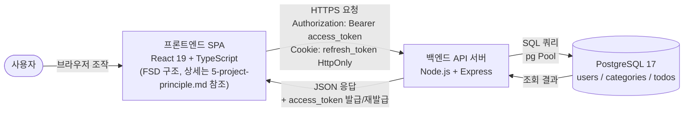
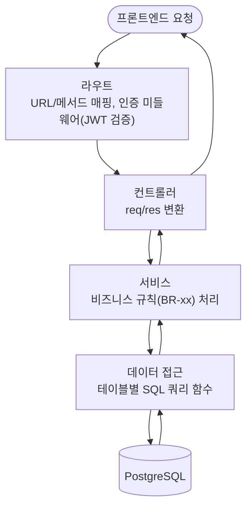
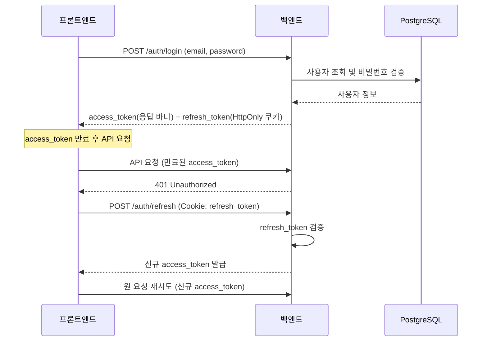

# my-todolist 아키텍처 다이어그램

## 버전 이력

| 버전 | 날짜 | 변경 내용 | 작성자 |
|---|---|---|---|
| 0.1 | 2026-08-26 | 최초 작성 | ohhyeun |

## 1. 문서 개요

### 1.1 목적

본 문서는 할일 관리 웹 애플리케이션 "my-todolist"의 시스템/네트워크 수준 아키텍처를 mermaid 다이어그램으로 표현한다. 1인 개발·2일 일정의 단순한 3-tier(프론트/백엔드/DB) 구조임을 전제로, 세부 파일·엔드포인트·컴포넌트 나열 없이 핵심 구조와 데이터 흐름만 다룬다.

### 1.2 관련 문서

- 도메인 정의서: [docs/1-domain-definition.md](./1-domain-definition.md) (v0.3)
- PRD: [docs/2-prd.md](./2-prd.md) (v0.2)
- 사용자 시나리오: [docs/3-user-scenario.md](./3-user-scenario.md) (v0.1)
- 와이어프레임: [docs/4-wireframe.md](./4-wireframe.md) (v0.1)
- 프로젝트 구조 설계 원칙: [docs/5-project-principle.md](./5-project-principle.md) (v0.3)

## 2. 전체 시스템 구성도

사용자 브라우저의 프론트엔드(SPA)가 백엔드 API 서버와 통신하고, 백엔드는 PostgreSQL을 통해 데이터를 영속화한다. access_token은 응답 바디로 전달되어 클라이언트 메모리에 보관되고, refresh_token은 HttpOnly 쿠키로 전달된다(5-project-principle.md 6절).

## 3. 백엔드 요청 처리 흐름

백엔드는 라우트 → 컨트롤러 → 서비스 → 데이터 접근 4계층으로 구성되며, 요청은 상위 계층에서 하위 계층으로만 흐른다(5-project-principle.md 3.1절).

## 4. 인증 흐름 (로그인 및 토큰 재발급)

로그인 시 access_token(짧은 만료)과 refresh_token(HttpOnly 쿠키, 긴 만료)이 함께 발급되며, access_token 만료 시 refresh_token으로 재발급을 시도한다(PRD 6.3절, 5-project-principle.md 6절).

