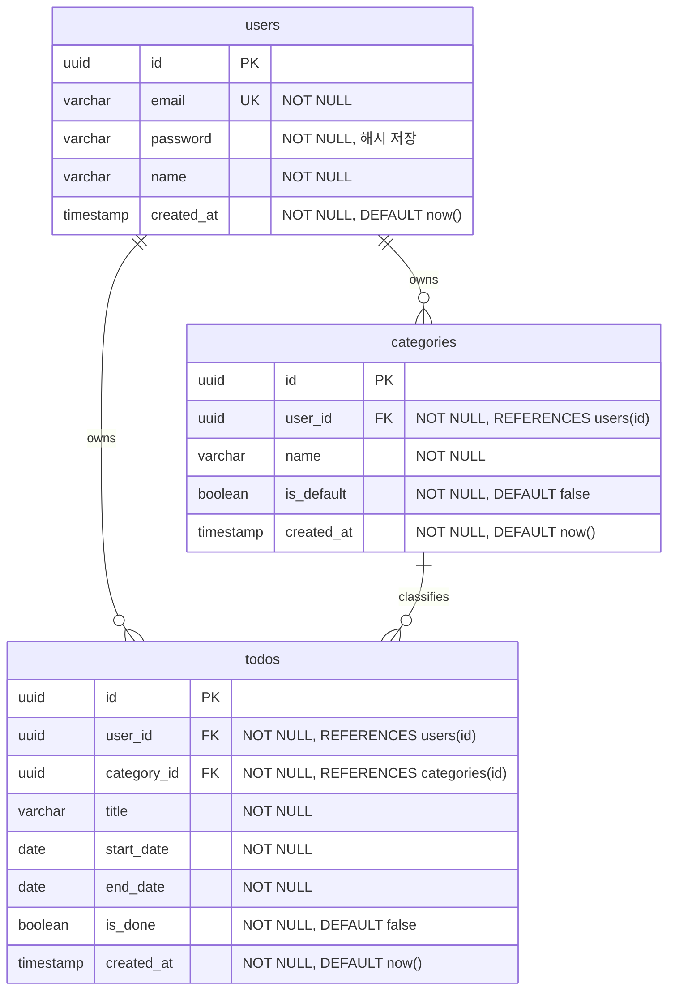

# my-todolist ERD

## 버전 이력

| 버전 | 날짜 | 변경 내용 | 작성자 |
|---|---|---|---|
| 0.1 | 2026-08-26 | 최초 작성 | ohhyeun |

## 1. 문서 개요

### 1.1 목적

본 문서는 "my-todolist"의 데이터베이스 스키마를 ERD(mermaid `erDiagram`)로 정의한다. 엔티티/속성/제약조건은 도메인 정의서에, 네이밍 규칙은 구조 설계 원칙 문서에 이미 정의되어 있으므로 본 문서는 이를 재서술하지 않고 테이블 구조로 구체화한다.

### 1.2 관련 문서

- 도메인 정의서: [docs/1-domain-definition.md](./1-domain-definition.md) (v0.3) — 엔티티(EN-01~03), 비즈니스 규칙(BR-xx)
- 프로젝트 구조 설계 원칙: [docs/5-project-principle.md](./5-project-principle.md) (v0.3) — 4절 코드/네이밍 원칙, 7.1절 백엔드 디렉토리 구조(migrations/001_init.sql)

## 2. ERD

## 3. 제약조건 보충

- `categories.name`은 (user_id, name) 조합 유니크(대소문자 무시, 트림 비교는 애플리케이션 계층에서 처리, EN-02/BR-08).
- `categories`: 사용자당 `is_default = true`인 행이 정확히 1개 존재해야 하며(EN-02), 해당 행은 삭제할 수 없다(BR-04).
- `todos`: `end_date >= start_date` 제약(BR-05).
- 인덱스: `users.email`, `todos.user_id`, `todos.category_id`(구조 설계 원칙 6절).
- `status`(시작전/진행중/완료/기한초과)는 `start_date`/`end_date`/`is_done`으로부터 조회 시점에 계산되는 파생값이므로(EN-03, BR-06) 어떤 테이블에도 컬럼으로 두지 않는다.
